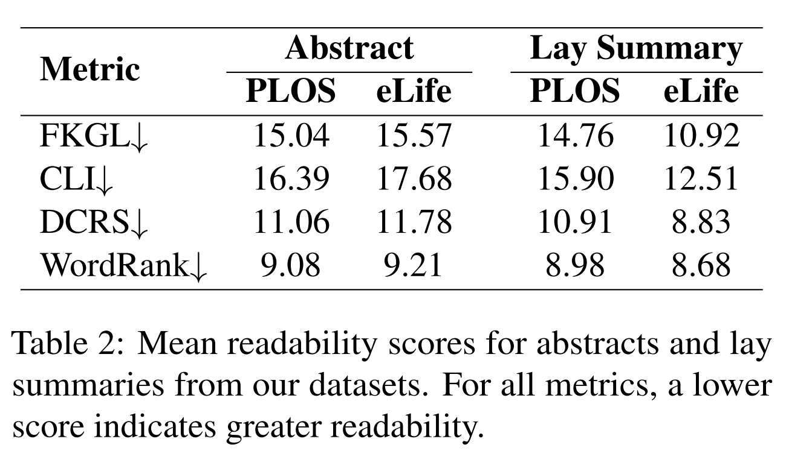
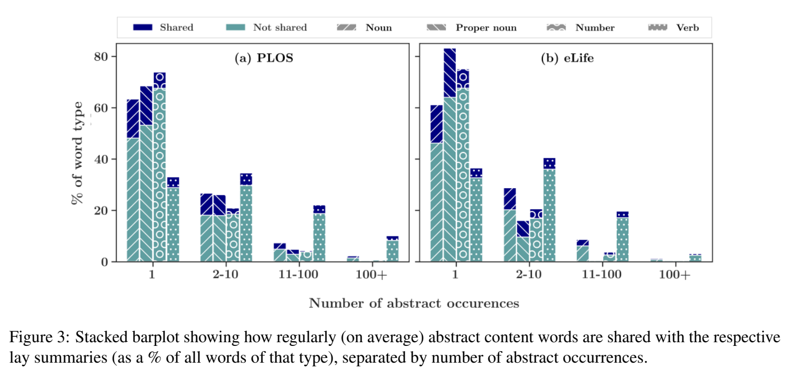
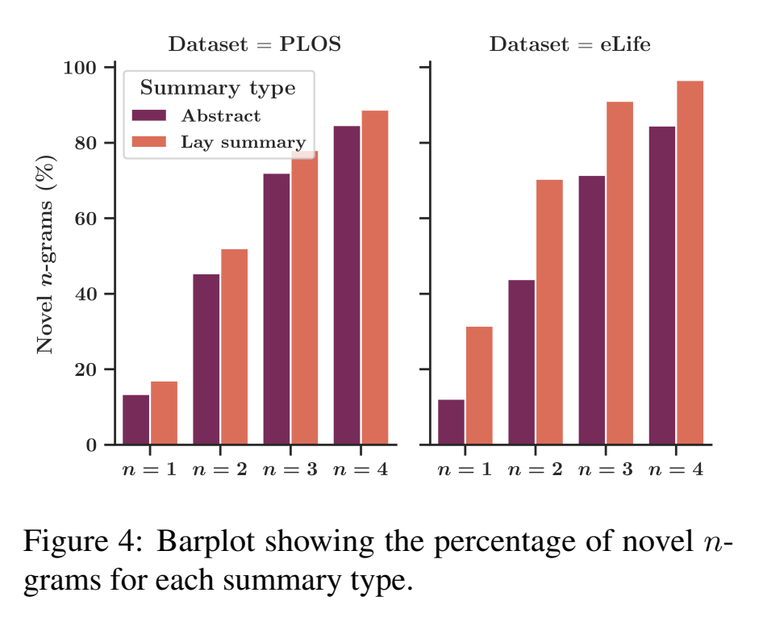

# Reproducing-Making-Science-Simple
We reproduce results from the paper "Making Science Simple: Corpora for the Lay Summarisation of Scientific Literature", published in EMNLP 2022 (link)[https://doi.org/10.18653/v1/2022.emnlp-main.724].

Specifically, we reproduce table 2, figure 3 and figure 4. These results compare the PLOS and eLife datasets in terms of readability of abstracts and summaries (table 2), overlap between words and POS-classes between abstracts and summaries (figure 3) and abstractiveness of vocabulary between the two summary datasets (figure 4).

## Data
Data is linked to on the [Corpora-for-Lay-Summarisation Repository](https://github.com/TGoldsack1/Corpora_for_Lay_Summarisation/tree/main) and includes the PLOS and eLife datasets.

Extract the dataset folders into a 'data' folder ('main/data/plos' and 'main/data/elife') to use the project code.

## The authors' claims

Results to be reproduced, with relevant exerpts from the paper.

> "The scores given in Table 2 show that the lay summaries of both datasets are consistently more readable than their respective abstracts across all metrics. Although these differences are small in some cases, in line with the findings of previous works (Devaraj et al., 2021), we find them all to be statistically significant by way of Mann–Whitney U tests (p < 0.05). These results indicate that lay summaries are more readable than technical abstracts in terms of both syntactic structure and lexical intelligibility. Additionally, the lay summaries from eLife obtain lower readability scores than those of PLOS across all metrics, confirming our expectation that they are suitable for less technical audiences."

> "Generally, we observe similar patterns for content words between datasets. Firstly, regardless of word type or number of abstract occurrences, we find that abstract content words are rarely shared with lay summaries (i.e., ‘shared’ % < ‘not shared’ % for all bars). This is indicative of a clear shift in content and/or vocabulary when it comes to the creation of a lay summary. For each dataset, we can also see that the vast majority of content words of all types, except verbs, occur in 10 or fewer abstracts (> 90% on average for both datasets), with most of these occurring within a single abstract. (...) 
> The pattern exhibited by verbs differs significantly from that of other word types, as they typically occur in a greater number of abstracts (most commonly being present within 2-10). For content words of all types, we observe that the ratio of ‘shared’ to ‘not shared’ generally increases in line with the number of abstract occurrences."

> "(...) lay summaries consistently contain more novel n-grams than abstracts across both datasets. However, the lay summaries of eLife (...) appear to be significantly more abstractive."

## Our findings
